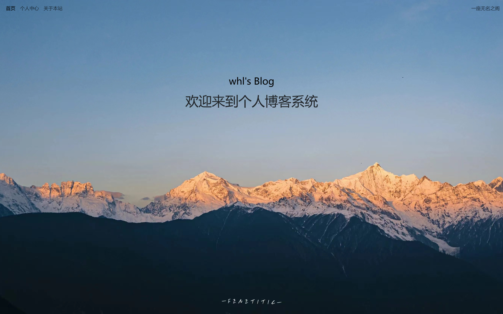
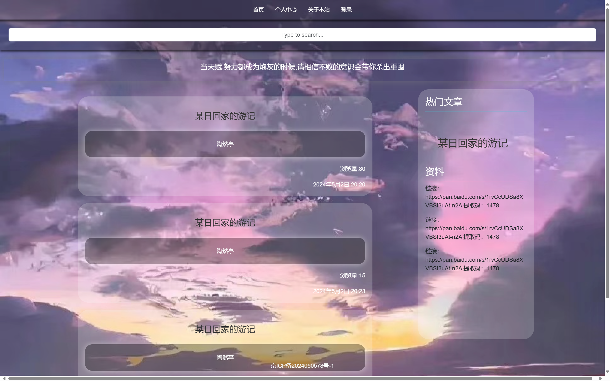

# Blog

🏯**这个博客我取名未铭阁，希望在茫茫网络中能为你提供一些力所能及的帮助，也不需要别人去记住的无名阁楼**

**基于`python3.11`和`Django5.0`的博客。** 

## 部分展示效果





## 主要功能：
- **在进入时首先看到一个封面**
- **可以分页，搜索个人中心的文章**
- **具有用户登录登出的功能**
- **具有个人评论功能**
- **前端基于bootstrap 后端基于django**
- **具有热门文章的推荐，基于文章我浏览量**
- **最主要的是在移动端也有着强劲的表现**

## 运行


 **修改`djangoblog/setting.py` 修改数据库配置，如下所示：**

```python
DATABASES = {
    'default': {
        'ENGINE': 'django.db.backends.mysql',
        'NAME': '0',
        'USER': 'root',
        'PASSWORD': 'password',
        'HOST': 'host',
        'PORT': 3306,
    }
}
```

### 创建数据库
**mysql数据库中执行:**
```sql
CREATE DATABASE `0` /*!40100 DEFAULT CHARACTER SET utf8mb4 COLLATE utf8mb4_unicode_ci */;
```

**然后终端下执行:**
```bash
python manage.py makemigrations
python manage.py migrate
```

### 创建超级用户

 **终端下执行:**
```bash
python manage.py createsuperuser
```
### 开始运行：
```bash
执行： `python manage.py runserver`
```

**浏览器打开: http://127.0.0.1:8000/  就可以看到效果了。**  


## 问题相关

有任何问题欢迎提Issue,或者将问题描述发送至我邮箱 `whlgc0725@163.com`.我会尽快解答.推荐提交Issue方式.  

---
 ## 致大家🙋‍♀️🙋‍♂️
 如果本项目帮助到了你，请在[这里](https://github.com/whl0725/whl0725/issues)留下你的网址，让更多的人看到。
您的回复将会是我继续更新维护下去的动力。 
